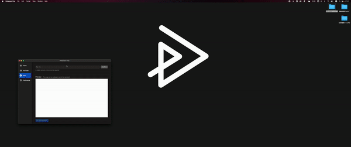

# Wallpaper Play

The wallpaper engine for macOS.

# App Store
Sorry, Not yet published.

# Feature

This app allows you to set videos as macOS wallpaper.

## Contents that can be set as wallpaper

- local video ( .mp4, .mov etc...)
- youtube
- website

## Previews
### Video

### YouTube

### Website

